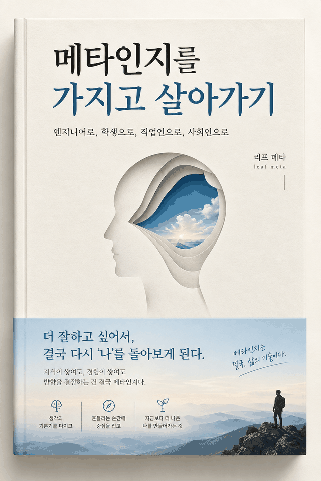

# 메타인지를 가지고 살아가기

부제는 엔지니어로, 학생으로, 직업인으로, 사회인으로.

**이 책은 자기계발서가 아니다.** 방법을 파는 책이 아니라, 자기 판단이 어느 자리에서 어긋나는지를 네 역할에서 따라간 기록이다.

지은이 리프 메타 (leaf meta). 무료로 배포할 수 있고, 조건은 출처 표기 하나다.

## 이 책이 파는 것

각주가 붙은 문장은 실험실이 확인해 준 것이다. 붙지 않은 문장은 지은이가 겪었거나 지어낸 것이다. 그리고 뒤로 갈수록 각주가 줄어든다. 앞부분은 실험실이 답해 준 자리이고 뒤로 갈수록 답해 주지 않는 자리이기 때문이다.

| 자리 | 각주 |
|---|---|
| 0장 | 8 |
| 1부 | 37 |
| 2부 | 30 |
| 3부 | 11 |
| 4부 | 10 |
| 5부 | 8 |
| 6부 | 2 |
| 에필로그 | 0 |

절 72개, 각주 항목 75개, 각주 호출 106회. 인쇄본 실측 286쪽.

## 읽는 곳

브라우저에서 한 권을 그대로 넘겨 읽는다. 내려받지 않아도 되고 계정도 필요 없다.

### https://leaf-kit.github.io/book-metacognition/

내려받아 읽거나 인쇄하려면 [릴리즈](https://github.com/leaf-kit/book-metacognition/releases/latest)에 붙인 PDF 를 받는다. 웹판과 같은 판이다. 본문은 저장소에 두지 않는다.

아래 차례의 절은 웹에서 낱장으로 읽는다. 각주는 문장 옆에 그대로 붙어 있다.

## 차례

### 0장

- [아는 것 같은 느낌](s001.md)
- [자기계발서가 이 말을 가져간 뒤](s002.md)
- [생각을 생각한다는 말의 실제 크기](s003.md)
- [이 책이 하지 않는 것](s004.md)

### 1부, 기본기

- [형광펜을 그은 페이지는 왜 다시 봐도 새로운가](s005.md)
- [설명해 보라고 하면 무너지는 것들](s006.md)
- [내 확신은 어디서 오는가](s007.md)
- [다 아는 얘기라고 느낄 때](s008.md)
- [빠르게 가르는 신호 세 가지](s008b.md)
- [모른다고 말하는 데 드는 비용](s009.md)
- [예측을 적어 두는 사람](s010.md)
- [70퍼센트라고 말했을 때의 70퍼센트](s011.md)
- [가른 다음 삼십 초 안에 하는 것](s011b.md)
- [틀린 다음 날에 하는 일](s012.md)
- [되짚기의 최소 단위](s013.md)
- [남 탓과 내 탓 사이에 있는 칸](s014.md)

### 2부, 학생으로서

- [다시 읽기가 가장 인기 있는 이유](s015.md)
- [필기를 잘하는 사람과 이해한 사람](s016.md)
- [막히는 지점을 기록하는 노트](s017.md)
- [시험 전날의 나와 시험장의 나](s018.md)
- [진도가 나가는 느낌과 실제 진도](s019.md)
- [공부 시간을 어디에 쓰는가](s019b.md)
- [무엇을 모르는지 목록으로 만드는 저녁](s020.md)
- [남들이 쓰는 공부법을 다시 읽는다](s020b.md)
- [어려운 것을 먼저 두는 배치](s021.md)
- [선생이 없는 자리에서 배우기](s022.md)
- [아는 것을 세 칸으로 나눈다](s022b.md)
- [다 배운 것 같을 때 남에게 설명한다](s023.md)

### 3부, 엔지니어로서

- [이해했다고 느낀 순간이 가장 위험하다](s024.md)
- [디버깅은 가설을 세는 일이다](s025.md)
- [될 것 같은데요](s026.md)
- [추정치를 두 배로 부르는 사람의 속마음](s027.md)
- [안 되던 게 갑자기 될 때 멈춘다](s028.md)
- [리뷰를 받은 다음 3초](s029.md)
- [모르는 것을 검색어로 바꾸는 능력](s030.md)
- [설계 회의에서 내가 침묵한 이유](s031.md)
- [장애 회고에서 진짜로 남는 문장](s032.md)
- [받은 초안을 읽는 눈](s033.md)
- [검증이 병목이 된다](s034.md)
- [되돌릴 수 있는가로 확인의 깊이를 정한다](s034b.md)
- [내가 한 판단과 넘겨받은 판단](s035.md)

### 4부, 직업인으로서

- [연차가 실력의 증거가 되지 않는 이유](s036.md)
- [바쁨과 성과 사이](s037.md)
- [내가 한 말을 내가 못 알아듣는 회의](s038.md)
- [피드백을 받고 나서 일주일](s039.md)
- [잘하는 일과 좋아하는 일 사이의 세 번째 질문](s040.md)
- [이직을 결심한 이유와 실제 이유](s041.md)
- [커리어 계획이 안 맞는 이유](s042.md)
- [번아웃이라고 부르면 편해지는 것들](s043.md)
- [지금 정할지 미룰지](s043b.md)
- [가르치는 쪽에 섰을 때](s044.md)
- [평가하는 자리에 앉은 다음](s045.md)
- [조직이 대신 판단해 주는 것들](s046.md)

### 5부, 사회인으로서

- [기사를 읽고 화가 났을 때](s047.md)
- [내 의견이 언제 생겼는지 기억나는가](s048.md)
- [같은 편의 주장만 잘 이해되는 이유](s049.md)
- [숫자가 나오면 마음이 놓이는 습관](s050.md)
- [믿기 전에 묻는 세 가지](s050b.md)
- [돈 쓸 때의 나와 계획할 때의 나](s051.md)
- [관계에서 내가 반복하는 문장](s052.md)
- [나이가 들수록 확신이 늘어나는 현상](s053.md)
- [건강과 몸에 대해 아는 것](s054.md)
- [내가 나를 설명할 때 쓰는 이야기](s055.md)

### 6부, 대신 생각해 주는 것 옆에서

- [초안을 받은 다음에 무엇을 하는가](s056.md)
- [읽기가 어려워졌다](s057.md)
- [그럴듯함과 맞음을 가르는 눈](s058.md)
- [내가 고른 것을 댈 수 있는가](s059.md)
- [다시 손으로 해 보는 사람들](s060.md)
- [아이들은 이 경계를 안 겪는다](s061.md)
- [무엇을 맡기고 무엇을 안 맡기는가](s061b.md)
- [그래서 무엇을 계속 사람이 하는가](s062.md)

### 에필로그

- [아는 것 같은 느낌, 다시](s063.md)

## 그 밖에

- [어디가 걸렸을 때 어디를 펴는가](lookup.md)
- [이 책이 출발한 연구들](sources.md)
- [역할별 단계 지도](stagemap.md)

## 인쇄해서 쓰는 양식

- [되짚기 세 줄](forms/reflect3.md)
- [오판 노트](forms/misjudge.md)
- [확신 눈금표](forms/gauge5.md)
