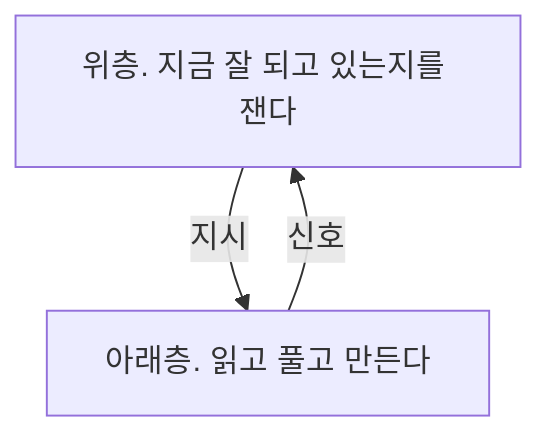

*0장 &middot; 역할 없음*

# 생각을 생각한다는 말의 실제 크기

후배가 나에게 물었다. 그거 결국 명상 같은 건가요. 나는 아니라고 했다. 그러면 뭐냐고 다시 물었을 때 세 문장을 말하고 막혔다. 막힌 자리에서 내가 한 말은 그러니까 뭐랄까, 였다. 스무 해를 그 낱말 근처에서 보낸 사람의 답으로는 좀 곤란했다.

막힌 자리는 늘 같다. 이 낱말을 풀이하려고 하면 머릿속을 들여다보는 그림이 먼저 떠오른다. 눈을 감고 자기 생각을 관찰하는 사람. 그 그림이 틀렸다.

이 말이 학술 쪽에서 가리키는 것은 관찰이 아니라 판단이다. 내가 이걸 얼마나 아는지에 대한 판단, 이 방법이 잘 되고 있는지에 대한 판단, 지금 멈출지 계속할지에 대한 판단. 전부 무언가를 재는 일이다.

머릿속을 두 층으로 나눠 보면 편하다. 아래층은 일한다. 읽고, 풀고, 만든다. 위층은 아래층을 지켜보면서 지금 잘 되고 있는지를 잰다. 그리고 재고 나서 아래층에 지시를 내린다. 더 읽으라거나, 그만두라거나. 넬슨과 네이런스가 1990년에 이 두 층짜리 그림을 정리했다.[출발점 &middot; Nelson & Narens, 1990, Psychology of Learning and Motivation. doi.org/10.1016/s0079-7421(08)60053-5 (2026-09-02 확인)]

*위층은 아래층을 못 들여다본다. 신호 몇 개를 보고 짐작한다.*

위층이 하는 일은 정확한 관찰이 아니다. 추정이다. 그리고 그 추정은 자주 틀린다. 위층은 아래층을 들여다보지 못하고, 아래층이 내놓는 신호 몇 개를 보고 짐작할 뿐이다. 매끄럽게 읽히는가. 술술 떠오르는가. 익숙한가. 그 신호들이 실제 앎과 얼마나 맞물려 있는지는 자리마다 다르다.

여기서 이 책의 낱말 하나가 나온다. **표본**이다. 무엇을 판단하려고 실제로 모아 본 몇 개의 사례라는 뜻이다. 내가 나를 잰다는 것은 내 판단을 몇 개 모아서 그것이 어땠는지 세어 본다는 뜻이지, 내 머릿속을 들여다본다는 뜻이 아니다.

이 차이가 크다. 들여다보는 일은 지금 할 수 있고 혼자 할 수 있다. 세어 보는 일은 시간이 걸리고 기록이 있어야 한다. 그래서 앞의 것은 오늘 저녁에 할 수 있고 뒤의 것은 여섯 달이 걸린다. 사람들이 앞의 것을 고르는 데는 그만한 이유가 있다.

위층이 왜 자주 틀리는지에 대해서는 확인된 이유가 하나 있다. 공부하는 동안에는 답이 눈앞에 있고 시험장에는 없다. 위층은 눈앞에 있는 것을 빼고 재지 못한다. 그래서 눈앞에 답이 있는 상태에서 잰 숫자를, 답이 없는 상태에서도 그럴 것이라고 읽는다. 코리앗과 비요크가 2005년에 이것을 실험으로 보였다.[확인 &middot; Koriat & Bjork, 2005, Journal of Experimental Psychology: Learning, Memory, and Cognition. doi.org/10.1037/0278-7393.31.2.187 (2026-09-02 확인)]

플라벨이 1979년에 이 낱말로 다룬 것은 아이들이었다. 아이가 무언가를 외우면서 자기가 다 외웠는지를 어떻게 판단하는가.[출발점 &middot; Flavell, 1979, American Psychologist. doi.org/10.1037/0003-066x.34.10.906 (2026-09-02 확인)] 그러니까 처음부터 이 말은 깊은 생각에 대한 것이 아니라, 다 됐는지 아닌지를 아는 일에 대한 것이었다.

명상과 갈리는 자리도 여기다. 하나는 지금 이 순간에 머무는 일이고, 다른 하나는 지난 판단을 꺼내서 결과와 맞춰 보는 일이다. 방향이 반대다.

실제로 위층이 틀리는 방식은 한 가지가 아니다. 잘 안 되고 있는데 잘 되고 있다고 재는 쪽이 흔하고, 반대쪽도 있다. 어려운 일에서는 자기를 높게 보고 쉬운 일에서는 낮게 본다는 정리가 있는데, 그 이야기는 1부에서 눈금을 만들 때 다시 나온다.

후배에게는 나중에 다시 설명했다. 자기 판단을 남의 판단처럼 다루는 일이라고 했다. 후배가 그러면 좀 피곤하겠다고 했다. 맞는 말이다. 그 피곤함은 4부에서 다시 다룬다.

이 책의 나머지는 그 세어 보는 일이 자리마다 얼마나 어려워지는지에 대한 것이다. 한 페이지에서는 쉽고, 한 평생에서는 거의 불가능하다.

> **오늘 할 것**
>
> 오늘 내린 판단 하나를 종이에 적어라. 판단만 적고 결과 칸은 비워 두어라. 결과는 나중에 채운다.

---

이전: [「자기계발서가 이 말을 가져간 뒤」](s002.md)  
다음: [「이 책이 하지 않는 것」](s004.md)  
[목차](README.md)
