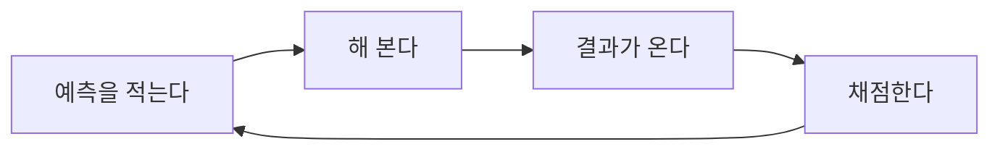

*1부, 기본기 &middot; 역할 없음*

# 예측을 적어 두는 사람

동료가 회의에서 이렇게 말했다. 제가 그럴 줄 알았어요. 그 말이 나온 것은 일이 잘못되고 나서 이틀 뒤였다. 그리고 나는 그 사람이 이틀 전에 무슨 말을 했는지 기억하고 있었다. 그때는 괜찮을 것 같다고 했다.

그 사람이 거짓말을 한 것은 아니다. 이건 아주 흔한 일이고 나도 매달 한다.

로즈와 보스가 2012년에 이 되고쳐 쓰기를 모아 정리했다. 여러 자리에서 되풀이 확인되었고, 나이나 성격으로 잘 안 갈린다.[출발점 &middot; Roese & Vohs, 2012, Perspectives on Psychological Science. doi.org/10.1177/1745691612454303 (2026-09-02 확인)] 기억이 앞을 고쳐 쓴다. 고쳐 쓰는 동안 본인은 고치고 있다는 것을 모른다. 그래서 이건 정직함의 문제가 아니다.

아는 사람에게도 온다. 이 문장을 쓰고 있는 나에게도 온다. 알고 있다고 안 오는 것이 아니라는 점이 이 자리의 어려움이다.

여기서 나오는 결론은 하나다. 예측은 머리에 두면 안 된다. 종이에 있어야 한다.

종이에 있어야 하는 이유는 정확해서가 아니라 안 변해서다. 내가 지난주에 무엇을 예상했는지가 그대로 남아 있으면, 이번 주에 결과와 맞춰 볼 수 있다. 그 맞춰 보는 일을 이 책에서는 **채점**이라고 부른다. 미리 적어 둔 예측을 결과와 나란히 놓는 일이다.

*이 책에 나오는 유일한 절차도. 네 칸 중 하나만 빠져도 안 돈다.*

이 바퀴에서 사람들이 가장 자주 빠뜨리는 칸은 첫 번째다. 해 보는 것과 결과를 보는 것은 저절로 된다. 채점도 마음만 먹으면 된다. 그런데 예측을 적어 두지 않으면 채점할 것이 없다. 결과만 남는다.

결과만 남으면 그 결과에 맞는 예측이 사후에 만들어진다. 그럴 줄 알았다는 문장은 그 과정의 마지막 단계다.

예측을 적는 방식 중에 한 가지 재미있는 것이 있다. 이미 끝난 일이라고 치고 이유를 대게 하는 것이다. 라고 부른다. 미첼과 루소와 페닝턴이 1989년에 해 본 것이다. 이 일이 이미 망했다고 가정하고 왜 망했는지 적게 하면, 그냥 위험을 물었을 때보다 떠올리는 이유의 수가 늘었다.[출발점 &middot; Mitchell, Russo & Pennington, 1989, Journal of Behavioral Decision Making. doi.org/10.1002/bdm.3960020103 (2026-09-02 확인)] 방향이 바뀌면 보이는 것이 달라진다.

나는 이걸 새 일을 시작할 때 쓴다. 시작하는 날에 종이 한 장을 놓고, 반년 뒤에 이게 망해 있다고 치고 이유를 다섯 개 적는다. 그리고 그 종이를 서랍에 넣는다.

지난번 종이를 반년 뒤에 꺼내 봤을 때, 다섯 개 중에 실제로 일어난 것은 하나였다. 나머지 넷은 안 일어났고, 실제로 일을 어렵게 만든 것은 그 종이에 없던 것이었다. 그러니까 이 방법은 미래를 맞히지 못한다.

그런데 그 하나를 적어 뒀기 때문에 나는 그것이 오는 것을 두 달 먼저 봤다. 두 달이 그 종이의 값이었다.

동료의 그 말은 지금도 가끔 생각난다. 나는 그때 아무 말도 안 했다. 이틀 전에 뭐라고 했는지 기억한다고 말했다면 그건 지적이지 기록이 아니다. 대신 그날부터 회의에서 나오는 예측을 한 줄씩 적기 시작했다. 내 것부터 적었다.

> **오늘 할 것**
>
> 이번 주에 시작하는 일 하나를 골라라. 반년 뒤에 망했다고 치고 이유를 다섯 개 적어 서랍에 넣어라.

---

이전: [「모른다고 말하는 데 드는 비용」](s009.md)  
다음: [「70퍼센트라고 말했을 때의 70퍼센트」](s011.md)  
[목차](README.md)
