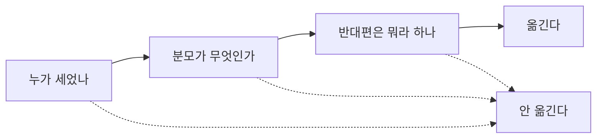

*5부, 사회인으로서 &middot; 사회인으로*

# 믿기 전에 묻는 세 가지

어떤 사람이 나에게 이야기를 하나 해 줬다. 이야기가 좋았다. 좋아서 나는 그 자리에서 믿었고, 그 주에 다른 사람 셋에게 옮겼다. 한 달 뒤에 그 이야기가 틀렸다는 것을 알았다. 옮긴 셋에게 다시 가서 정정하지는 않았다. 그게 이 절을 쓰게 만든 자리다.

옮기기 전에 무엇을 했어야 했나. 그 자리에서 삼십 분을 들여 확인할 수는 없었다. 대화 중이었고 다음 이야기가 이어지고 있었다. 그때 나에게 있었던 것은 삼십 초쯤이고, 삼십 초로 되는 것을 찾아야 했다. 이 절은 그 삼십 초짜리 물건이다.

**믿기 전에 묻는 것**

| 칸 | 적는 것 |
|---|---|
| 누가 세었나 | |
| 분모가 무엇인가 | |
| 반대편은 뭐라고 하나 | |

*셋 중 하나에서 걸리면 옮기지 않는다. 안 믿는 것과는 다르다.*

첫 칸은 앞에서 나온 이야기다. 숫자는 누가 셌는지가 안 적혀 있어도 숫자로 보인다. 사람 이름이 안 나오는 주장은 대개 아무도 안 센 것이다.

두 번째 칸은 분모다. 절반이 그렇다는 말에서 절반의 아래가 무엇인지를 묻는다. 스무 명 중 열이면 그건 스무 명 이야기다. 분모가 안 적힌 비율은 대개 분모가 작아서 안 적혔다. 크면 적었을 것이다.

세 번째 칸이 제일 오래 걸린다. 반대편이 뭐라고 하는지를 한 문장으로 적어야 한다. 안 나오면 그건 내가 아직 그 이야기를 모른다는 뜻이다. 앞에서 반대쪽 주장을 세 문장으로 요약해 보는 이야기를 했는데, 여기서는 한 문장이면 된다. 한 문장도 안 나오는 경우가 절반이 넘는다.

지난달에 어떤 기사를 옮기려다가 이 종이를 폈다. 채운 것은 이랬다.

| 칸 | 채운 것 |
|---|---|
| 누가 세었나 | 어느 기관. 기관 이름은 나왔고 방법은 안 나왔다 |
| 분모가 무엇인가 | 모르겠다. 기사에 안 적혀 있다 |
| 반대편은 뭐라고 하나 | 반대편 이야기를 못 찾았다 |

세 칸이 다 비었다. 이럴 때 내가 하는 것은 안 옮기는 것이다. 안 믿는 것이 아니라 안 옮긴다. 이 둘은 다르다. 믿는 것은 내 안에서 끝나고 옮기는 것은 밖으로 나간다.

이 구분이 이 양식의 값이다. 세 칸을 채우는 데 삼십 초가 들고, 못 채웠을 때 하는 일은 아무것도 안 하는 것이다. 아무것도 안 하는 데는 시간이 안 든다.

> **여기서는 안 통한다**
>
> 세 칸을 다 제대로 채우려면 삼십 초가 아니라 삼십 분이 든다. 분모를 찾으려면 원 자료를 열어야 하고 반대편을 찾으려면 검색을 해야 한다. 하루에 그렇게 할 수 있는 것은 두세 개다. 나머지 수십 개에 대해서는 나도 그냥 지나간다.

그래서 나는 이 양식을 옮기려는 것에만 쓴다. 읽는 것 전부에 대지 않는다. 옮기는 것은 하루에 두세 개고, 그 두세 개가 남에게 가는 것이기 때문이다. 지난 석 달 동안 이 종이를 스물두 번 폈다. 세 칸이 다 찬 것은 다섯이었다. 다섯만 옮겼다. 그전에는 한 달에 스무 개쯤 옮겼으니 사분의 일로 줄었다.

줄어든 것이 좋은 일인지는 모르겠다. 내가 안 옮긴 열일곱 개 중에 맞는 것도 있었을 것이고, 그중 하나는 누군가에게 쓸모가 있었을지도 모른다. 다만 옮겨 놓고 한 달 뒤에 정정하러 다니는 일은 그 뒤로 없었다.

> **오늘 할 것**
>
> 남에게 옮기기 전에 세 칸을 채워라. 하나라도 비면 옮기지 마라. 믿는 것과 옮기는 것을 가르라.

---

이전: [「숫자가 나오면 마음이 놓이는 습관」](s050.md)  
다음: [「돈 쓸 때의 나와 계획할 때의 나」](s051.md)  
[목차](README.md)
